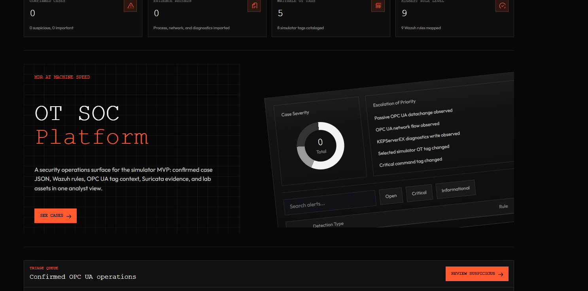
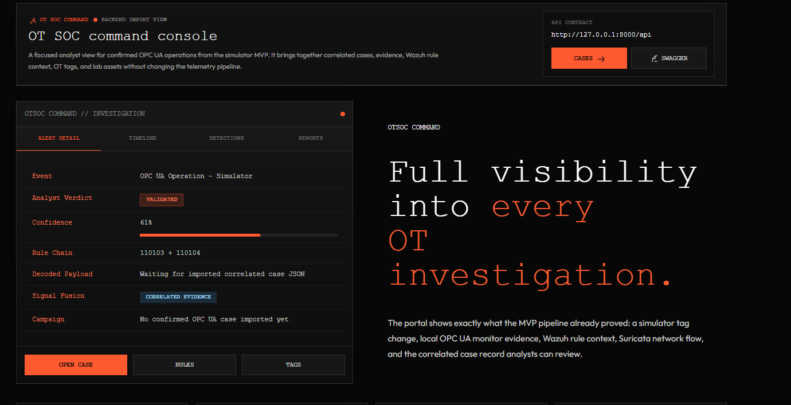
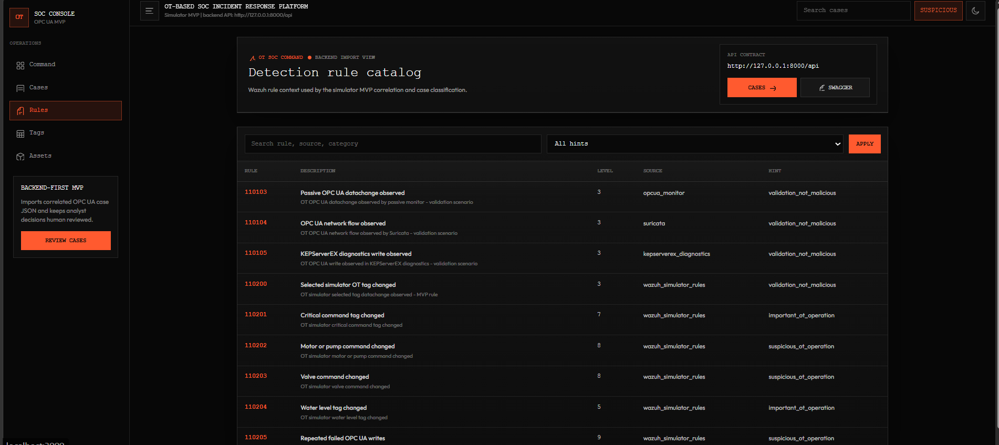

<a id="readme-top"></a>

[![CI][ci-shield]][ci-url]
[![Security][security-shield]][security-url]
[![Contributors][contributors-shield]][contributors-url]
[![Forks][forks-shield]][forks-url]
[![Stargazers][stars-shield]][stars-url]
[![Issues][issues-shield]][issues-url]

<br />
<div align="center">
  <a href="https://github.com/ahmed3bahaa/OT-Based-Soc-Incident-Response-Platform">
    
  </a>

  <h3 align="center">OT/ICS Incident Response Platform</h3>

  <p align="center">
    A human-supervised SOC incident-response MVP for correlating OPC UA process activity, Suricata network evidence, Wazuh alerts, and analyst-ready OT cases.
    <br />
    <a href="docs/OT_SOC_Live_Testing_Production_Guide.md"><strong>Explore the docs »</strong></a>
    <br />
    <br />
    <a href="#usage">View Usage</a>
    &middot;
    <a href="https://github.com/ahmed3bahaa/OT-Based-Soc-Incident-Response-Platform/issues/new">Report Bug</a>
    &middot;
    <a href="https://github.com/ahmed3bahaa/OT-Based-Soc-Incident-Response-Platform/issues/new">Request Feature</a>
  </p>
</div>

<details>
  <summary>Table of Contents</summary>
  <ol>
    <li>
      <a href="#about-the-project">About The Project</a>
      <ul>
        <li><a href="#built-with">Built With</a></li>
      </ul>
    </li>
    <li>
      <a href="#getting-started">Getting Started</a>
      <ul>
        <li><a href="#prerequisites">Prerequisites</a></li>
        <li><a href="#installation">Installation</a></li>
      </ul>
    </li>
    <li><a href="#usage">Usage</a></li>
    <li><a href="#architecture">Architecture</a></li>
    <li><a href="#project-structure">Project Structure</a></li>
    <li><a href="#validation">Validation</a></li>
    <li><a href="#security-notes">Security Notes</a></li>
    <li><a href="#roadmap">Roadmap</a></li>
    <li><a href="#contributing">Contributing</a></li>
    <li><a href="#license">License</a></li>
    <li><a href="#contact">Contact</a></li>
    <li><a href="#acknowledgments">Acknowledgments</a></li>
  </ol>
</details>

## About The Project

[![Platform overview placeholder][project-screenshot]](#architecture)

This project is a controlled OT/ICS SOC proof of concept for a simulated water-management environment. It is inspired by the CENTER Water testbed at Sakarya University, but the current local environment is a simulation and does not reproduce the full physical CENTER topology, real PLC/RTU behavior, vendor timing, or real water-process effects.

The platform is designed to turn raw OT telemetry into analyst-readable incident cases. It collects process and network evidence, sends events through Wazuh, normalizes alerts with Vector, ingests them into a Django REST backend, correlates evidence with OT asset and tag context, and displays cases in a Next.js SOC dashboard.

Current capabilities verified from this repository include:

- Secure Python OPC UA scenario client and passive monitor.
- OPC UA JSON Lines operation logging.
- Suricata network-flow evidence collection.
- Wazuh OT simulator rules and OPC UA detection rules.
- Vector HTTP sink configuration for live alert forwarding.
- Django REST Framework backend for cases, evidence, rules, tags, assets, live alerts, and Swagger/OpenAPI docs.
- Live Wazuh/Vector ingestion endpoints with backend-side correlation.
- PostgreSQL-backed Docker Compose stack for backend, frontend, and database.
- Next.js SOC dashboard for imported and live-correlated cases.
- Validation scripts, CI checks, dependency auditing, Bandit static analysis, and Gitleaks secret scanning.

The MVP is intentionally human-supervised. It prioritizes visibility, correlation, evidence review, and explainability over automatic containment or SOAR-style response.

<p align="right">(<a href="#readme-top">back to top</a>)</p>

### Built With

- [![Python][python-shield]][python-url]
- [![Django][django-shield]][django-url]
- [![Django REST Framework][drf-shield]][drf-url]
- [![Next.js][next-shield]][next-url]
- [![React][react-shield]][react-url]
- [![TypeScript][typescript-shield]][typescript-url]
- [![PostgreSQL][postgresql-shield]][postgresql-url]
- [![Docker][docker-shield]][docker-url]
- [![Wazuh][wazuh-shield]][wazuh-url]
- [![Suricata][suricata-shield]][suricata-url]
- [![Vector][vector-shield]][vector-url]

<p align="right">(<a href="#readme-top">back to top</a>)</p>

## Getting Started

The fastest local path is Docker Compose, which starts PostgreSQL, the Django backend, and the Next.js frontend together. Full live OT testing additionally requires a configured KEPServerEX simulator, OPC UA client tooling, Suricata, and Wazuh.

### Prerequisites

For the Docker MVP stack:

- Git.
- Docker Desktop or Docker Engine with Compose support.

For local development and validation:

- Python 3.13.
- Node.js 22 and npm.
- Docker Compose.
- Bash or PowerShell, depending on the validation script you run.

For the live OT lab:

- KEPServerEX exposing OPC UA on port `49320`.
- UaExpert or another OPC UA client for manual tag changes.
- Suricata for network evidence.
- Wazuh manager, indexer, and agents configured for the lab.

### Installation

1. Clone the repository:

   ```bash
   git clone https://github.com/ahmed3bahaa/OT-Based-Soc-Incident-Response-Platform.git
   ```

2. Open the project folder:

   ```bash
   cd OT-Based-Soc-Incident-Response-Platform
   ```

3. Create your environment file:

   ```powershell
   Copy-Item .env.example .env
   ```

   On Linux/macOS:

   ```bash
   cp .env.example .env
   ```

4. Fill local secrets in `.env`, especially:

   ```text
   POSTGRES_PASSWORD
   DJANGO_SECRET_KEY
   WAZUH_API_USERNAME
   WAZUH_API_PASSWORD
   WAZUH_API_TOKEN
   ```

5. Start the Docker MVP stack:

   ```bash
   docker compose up --build
   ```

6. Open the services:

   ```text
   Frontend:   http://127.0.0.1:3000
   Backend:    http://127.0.0.1:8000/api/
   Swagger UI: http://127.0.0.1:8000/api/docs/
   PostgreSQL: 127.0.0.1:5434
   ```

<p align="right">(<a href="#readme-top">back to top</a>)</p>

## Usage

### Docker MVP

Start the platform:

```bash
docker compose up --build
```

Start the optional Wazuh poller profile after configuring Wazuh or Indexer values in `.env`:

```bash
docker compose --profile wazuh-poller up -d wazuh-poller
```

Stop the stack:

```bash
docker compose down
```

Use `docker compose down -v` only when you intentionally want to delete disposable lab database data.

### Backend API

The Django backend exposes:

```text
GET  /api/health/
GET  /api/summary/
GET  /api/cases/
GET  /api/cases/{id}/
GET  /api/evidence/
GET  /api/live-alerts/
GET  /api/rules/
GET  /api/tags/
GET  /api/assets/
POST /api/cases/import/
POST /api/ingest/wazuh-alerts/
POST /api/ingest/vector-alerts/
GET  /api/schema/
GET  /api/docs/
```

Example import command:

```powershell
cd backend
python manage.py import_opcua_cases --file ..\tests\fixtures\correlation\opcua_cases_mixed.json
```

Example Wazuh alert ingestion:

```powershell
Invoke-RestMethod `
  -Method Post `
  -Uri "http://127.0.0.1:8000/api/ingest/wazuh-alerts/?window_seconds=900" `
  -ContentType application/json `
  -InFile .\wazuh-alerts-batch.json
```

### Frontend Dashboard

The frontend routes are:

```text
/          Command console
/cases     Case triage
/cases/:id Case evidence detail
/rules     Detection rule catalog
/tags      OT tag inventory
/assets    Lab asset map
```

For local frontend-only development:

```powershell
cd frontend
npm install
npm run dev
```

### Live Lab Automation

From Windows, start the live platform helper:

```powershell
.\scripts\start-live-platform.ps1
```

Skip Suricata when needed:

```powershell
.\scripts\start-live-platform.ps1 -SkipSuricata
```

Skip the Wazuh poller if credentials are not configured yet:

```powershell
.\scripts\start-live-platform.ps1 -SkipPoller
```

Check status:

```powershell
.\scripts\status-live-platform.ps1
```

Stop services:

```powershell
.\scripts\stop-live-platform.ps1
```

More live testing detail is available in [docs/OT_SOC_Live_Testing_Production_Guide.md](docs/OT_SOC_Live_Testing_Production_Guide.md).

### Visual Placeholders

Placeholder images are included under `docs/images/` so you can replace them manually later without changing the README layout.

<p align="center">
  
  
</p>

Suggested final visuals:

- SOC dashboard screenshot.
- OPC UA to Wazuh to Django to Next.js pipeline diagram.
- Case evidence detail screenshot.
- Wazuh/Suricata detection flow screenshot.

Avoid committing large `.mp4`, PCAP, JSONL, or raw lab evidence files. Use sanitized screenshots, diagrams, or GitHub Releases for larger demo videos.

<p align="right">(<a href="#readme-top">back to top</a>)</p>

## Architecture

The current planned and implemented data path is:

```text
UaExpert manual tag change
-> KEPServerEX OPC UA simulator
-> Python OPC UA monitor event
-> Wazuh process rule
-> Suricata network flow
-> Wazuh network rule
-> Vector or Wazuh/Indexer polling
-> Django live ingestion
-> backend correlation
-> confirmed OPC UA case
-> Next.js SOC dashboard
```

The main confirmed OPC UA operation pattern is process evidence plus network evidence within the configured correlation window. For example, the repository documentation describes valve validation through Wazuh rule `110203` and Suricata flow rule `110104`, producing a `confirmed_opcua_operation` case when both sides match.

<p align="center">
  
</p>

<p align="right">(<a href="#readme-top">back to top</a>)</p>

## Project Structure

```text
.
├── backend/          # Django REST Framework backend, models, importers, API views
├── correlation/      # OPC UA case correlation scripts
├── deploy/           # Deployment helpers such as systemd service files
├── docs/             # Architecture, live testing, pipeline, and correlation docs
├── frontend/         # Next.js SOC dashboard
├── kepserver/        # KEPServerEX diagnostic normalization scripts
├── opcua-client/     # Secure OPC UA client, monitor, certificate helper, tests
├── scripts/          # Local validation and live lab automation scripts
├── suricata/         # Suricata helper scripts
├── tests/            # Repository and correlation tests with fixtures
├── vector/           # Vector HTTP sink configuration
├── wazuh/            # Wazuh rules, fixtures, and rule test script
├── docker-compose.yml
└── README.md
```

<p align="right">(<a href="#readme-top">back to top</a>)</p>

## Validation

Run the Windows validation script:

```powershell
.\scripts\validate-local.ps1
```

Run the Linux/CI validation script:

```bash
./scripts/validate-ci.sh
```

The CI workflow validates Django checks and tests, repository tests, OPC UA client lint/tests, frontend lint/build, OpenAPI endpoint coverage, Docker Compose config, and Docker image builds.

The security workflow runs Gitleaks, Bandit, Python dependency audits, and frontend dependency auditing.

<p align="right">(<a href="#readme-top">back to top</a>)</p>

## Security Notes

Do not commit:

- `.env` files containing secrets.
- Private keys, runtime certificates, or Wazuh API tokens.
- Runtime JSONL, EVE, archive, or application logs.
- PCAP or PCAPNG captures.
- KEPServer diagnostic exports.
- Database runtime data.
- Sensitive infrastructure inventories.

Only sanitized templates, source code, documentation, tests, rules, and decoders should be committed.

<p align="right">(<a href="#readme-top">back to top</a>)</p>

## Roadmap

- [ ] Replace placeholder images with final screenshots and architecture diagrams.
- [ ] Add production deployment packaging.
- [ ] Complete the full analyst case lifecycle with notes and approval workflow.
- [ ] Expand evidence hashing and audit timeline coverage.
- [ ] Improve OT risk scoring beyond the current explainable rule-based classification.
- [ ] Add production-grade image hardening and release signing.

See the [open issues](https://github.com/ahmed3bahaa/OT-Based-Soc-Incident-Response-Platform/issues) for proposed features and known issues.

<p align="right">(<a href="#readme-top">back to top</a>)</p>

## Contributing

Contributions are welcome for documentation, test coverage, frontend workflows, backend correlation logic, and detection engineering.

1. Fork the project.
2. Create your feature branch:

   ```bash
   git checkout -b feature/AmazingFeature
   ```

3. Commit your changes:

   ```bash
   git commit -m "Add some AmazingFeature"
   ```

4. Push to the branch:

   ```bash
   git push origin feature/AmazingFeature
   ```

5. Open a pull request.

<p align="right">(<a href="#readme-top">back to top</a>)</p>

### Top Contributors

<a href="https://github.com/ahmed3bahaa/OT-Based-Soc-Incident-Response-Platform/graphs/contributors">
  
</a>

## License

No root license file has been added to this repository yet. Add a repository-level license before reuse or distribution outside the intended coursework and lab context.

The frontend folder contains its own `frontend/LICENSE`; review that file separately for frontend template licensing details.

<p align="right">(<a href="#readme-top">back to top</a>)</p>

## Contact

Ahmed Bahaa - [@ahmed3bahaa](https://github.com/ahmed3bahaa)

Project Link: [https://github.com/ahmed3bahaa/OT-Based-Soc-Incident-Response-Platform](https://github.com/ahmed3bahaa/OT-Based-Soc-Incident-Response-Platform)

<p align="right">(<a href="#readme-top">back to top</a>)</p>

## Acknowledgments

- README structure adapted from [ahmed3bahaa/readme-template](https://github.com/ahmed3bahaa/readme-template).
- CENTER Water testbed inspiration at Sakarya University, as described in the project documentation.
- Wazuh, Suricata, Vector, Django REST Framework, and Next.js ecosystems.

<p align="right">(<a href="#readme-top">back to top</a>)</p>

[ci-shield]: https://img.shields.io/github/actions/workflow/status/ahmed3bahaa/OT-Based-Soc-Incident-Response-Platform/ci.yml?branch=main&style=for-the-badge&label=CI
[ci-url]: https://github.com/ahmed3bahaa/OT-Based-Soc-Incident-Response-Platform/actions/workflows/ci.yml
[security-shield]: https://img.shields.io/github/actions/workflow/status/ahmed3bahaa/OT-Based-Soc-Incident-Response-Platform/security.yml?branch=main&style=for-the-badge&label=Security
[security-url]: https://github.com/ahmed3bahaa/OT-Based-Soc-Incident-Response-Platform/actions/workflows/security.yml
[contributors-shield]: https://img.shields.io/github/contributors/ahmed3bahaa/OT-Based-Soc-Incident-Response-Platform.svg?style=for-the-badge
[contributors-url]: https://github.com/ahmed3bahaa/OT-Based-Soc-Incident-Response-Platform/graphs/contributors
[forks-shield]: https://img.shields.io/github/forks/ahmed3bahaa/OT-Based-Soc-Incident-Response-Platform.svg?style=for-the-badge
[forks-url]: https://github.com/ahmed3bahaa/OT-Based-Soc-Incident-Response-Platform/network/members
[stars-shield]: https://img.shields.io/github/stars/ahmed3bahaa/OT-Based-Soc-Incident-Response-Platform.svg?style=for-the-badge
[stars-url]: https://github.com/ahmed3bahaa/OT-Based-Soc-Incident-Response-Platform/stargazers
[issues-shield]: https://img.shields.io/github/issues/ahmed3bahaa/OT-Based-Soc-Incident-Response-Platform.svg?style=for-the-badge
[issues-url]: https://github.com/ahmed3bahaa/OT-Based-Soc-Incident-Response-Platform/issues
[project-screenshot]: docs/images/platform-overview-placeholder.svg
[python-shield]: https://img.shields.io/badge/Python-3776AB?style=for-the-badge&logo=python&logoColor=white
[python-url]: https://www.python.org/
[django-shield]: https://img.shields.io/badge/Django-092E20?style=for-the-badge&logo=django&logoColor=white
[django-url]: https://www.djangoproject.com/
[drf-shield]: https://img.shields.io/badge/Django_REST_Framework-A30000?style=for-the-badge
[drf-url]: https://www.django-rest-framework.org/
[next-shield]: https://img.shields.io/badge/Next.js-000000?style=for-the-badge&logo=nextdotjs&logoColor=white
[next-url]: https://nextjs.org/
[react-shield]: https://img.shields.io/badge/React-20232A?style=for-the-badge&logo=react&logoColor=61DAFB
[react-url]: https://react.dev/
[typescript-shield]: https://img.shields.io/badge/TypeScript-3178C6?style=for-the-badge&logo=typescript&logoColor=white
[typescript-url]: https://www.typescriptlang.org/
[postgresql-shield]: https://img.shields.io/badge/PostgreSQL-4169E1?style=for-the-badge&logo=postgresql&logoColor=white
[postgresql-url]: https://www.postgresql.org/
[docker-shield]: https://img.shields.io/badge/Docker-2496ED?style=for-the-badge&logo=docker&logoColor=white
[docker-url]: https://www.docker.com/
[wazuh-shield]: https://img.shields.io/badge/Wazuh-005EB8?style=for-the-badge
[wazuh-url]: https://wazuh.com/
[suricata-shield]: https://img.shields.io/badge/Suricata-CB2D2E?style=for-the-badge
[suricata-url]: https://suricata.io/
[vector-shield]: https://img.shields.io/badge/Vector-111827?style=for-the-badge
[vector-url]: https://vector.dev/
